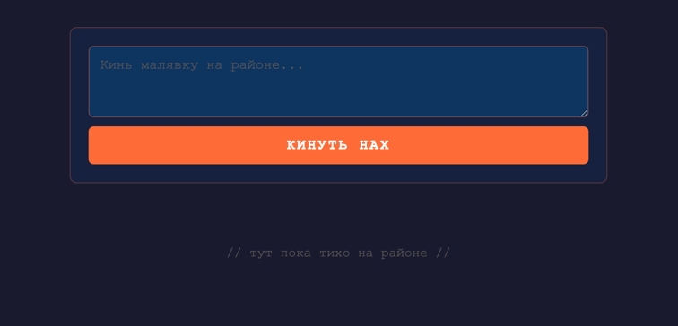
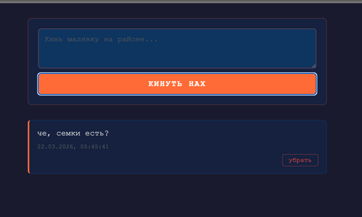

<div align="center">
  
  <br><br>
  
  
  
  
  
</div>

# Малявница

**Малявница** — это рофл-проект, написанный ради шутки в 3 часа ночи. Бэкенд — нормальный, на Spring Boot. Фронтенд — **чистый [YoptaScript](https://github.com/samgozman/YoptaScript)**, ЯП на основе русского тюремно-уличного сленга.

Простая доска сообщений: кинул малявку — она появилась. Не понравилась — убрал нах.

# Обзор проекта

## Стек

| Слой | Технология |
|---|---|
| Бэкенд | Java 21, Spring Boot 3.4, Lombok |
| Фронтенд | YoptaScript 2.0.6 |
| Хранилище | In-Memory (`ConcurrentHashMap`) |
| Сборка | Maven |


# Запуск

```shell
mvn spring-boot:run
```

После запуска открыть в браузере:

```
http://localhost:8080
```



# REST API

Базовый путь: `/api/messages`

---

### `GET /api/messages`

Возвращает список всех сообщений.

**Ответ** `200 OK`:
```json
[
  {
    "id": "3fa85f64-5717-4562-b3fc-2c963f66afa6",
    "text": "Привет, район!",
    "createdAt": "2026-03-22T12:00:00"
  }
]
```

---

### `POST /api/messages`

Создаёт новое сообщение.

**Тело запроса**:
```json
{
  "text": "Кинул малявку нах"
}
```

> `text` — обязательное поле, не может быть пустым (`@NotBlank`)

**Ответ** `201 Created`:
```json
{
  "id": "3fa85f64-5717-4562-b3fc-2c963f66afa6",
  "text": "Кинул малявку нах",
  "createdAt": "2026-03-22T12:00:00"
}
```

---

### `DELETE /api/messages/{id}`

Удаляет сообщение по идентификатору.

| Параметр | Тип | Описание |
|---|---|---|
| `id` | `UUID` | Идентификатор сообщения |

**Ответ** `204 No Content`

**Ошибка** `404 Not Found` — если сообщение не найдено

---

# Фронтенд — YoptaScript

Фронтенд написан на [YoptaScript](https://github.com/samgozman/YoptaScript) — настоящем языке программирования на тюремном сленге. Код транспилируется в JavaScript прямо в браузере через `yopta.js`.

Пример кода из проекта:

```
ебало.загрузить сука йопта() жЫ
    ебало.xhr('GET', '/api/messages', нуллио, 200, йопта(req) жЫ
        гыы msgs сука JSON.parse(req.responseText) нах
        msgs.пероПодРебро(йопта(msg) жЫ
            wall.заделатьПездюка(ебало.намутитьКарточку(msg)) нах
        есть) нах
    есть) нах
есть нах
```

Словарь языка: [dictionary.ts](https://github.com/samgozman/YoptaScript/blob/master/src/dictionary/dictionary.ts)

---

> **Дисклеймер**
>
> Данный проект создан исключительно в юмористических целях. Все использованные слова и выражения взяты из открытого проекта [YoptaScript](https://github.com/samgozman/YoptaScript) и не направлены на оскорбление, унижение или дискриминацию кого-либо. Автор глубоко уважает всех участников общества, законопослушных граждан, а также граждан, временно не являющихся законопослушными. Никакого злого умысла нет. Это просто код. Не надо на бутылку.
